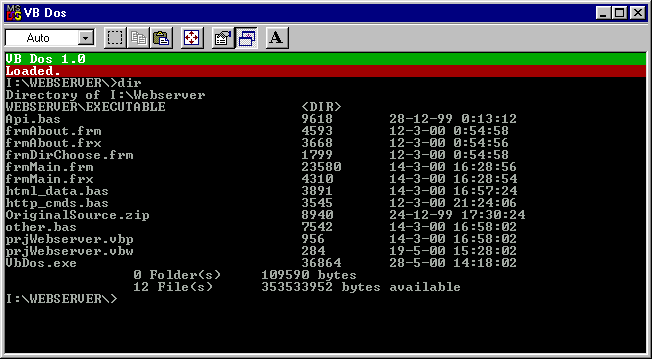



## VB DOS

### Description

Show how you can create your own console, and give it some purpose
 
### More Info
 
Some DOS commands!

The command "cd.." does not work

return values of DOS commands

If you close the console (by using the "X") the VB Environment will close too.

             |
---                |---
**Submitted On**   |2000-05-28 14:18:12
**By**             |[Almar Joling](https://github.com/Planet-Source-Code/PSCIndex/blob/master/ByAuthor/almar-joling.md)
**Level**          |Beginner
**User Rating**    |4.6 (37 globes from 8 users)
**Compatibility**  |VB 5\.0, VB 6\.0
**Category**       |[Complete Applications](https://github.com/Planet-Source-Code/PSCIndex/blob/master/ByCategory/complete-applications__1-27.md)
**World**          |[Visual Basic](https://github.com/Planet-Source-Code/PSCIndex/blob/master/ByWorld/visual-basic.md)
**Archive File**   |[CODE\_UPLOAD61915282000\.zip](https://github.com/Planet-Source-Code/almar-joling-vb-dos__1-8425/archive/master.zip)

### API Declarations

See code

